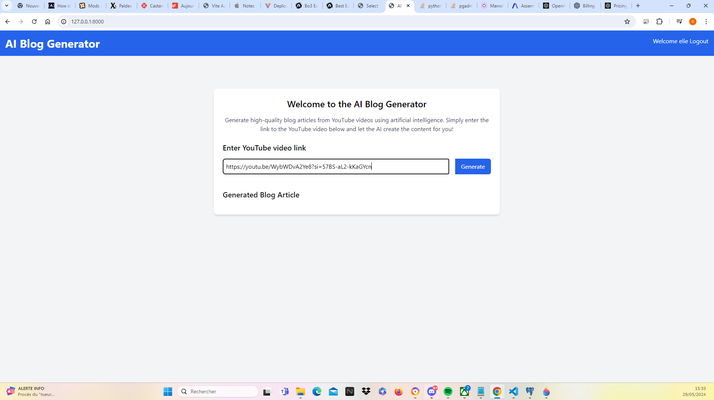
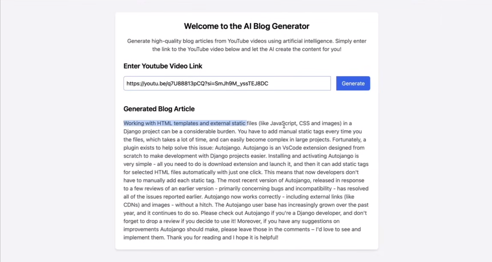

# Ai blog article genearator app

This is an app generating blog articles from youtube videos. It use python with django framework, html, css, javascript and tailwind css. The user can put a link of a YouTube video in and the app use assemby AI to generate a transcript of the audio of the video. It then use OpenAi text model to write it in the form of a blog article and save it on the database so the user can access the articles

Ceci une application web qui génère des articles de blog à partir de vidéos youtube.   Cette app a été dévellopée avec python en utilisant le framework django, html, css, javascript et tailwind css. L'utilisateur peut envoyer un lien d'une video YouTube dans l'app et l'application utilise assembly AI pour générer une transcription de l'audio de la vidéo. L'app utilise ensuite le model textuel openAI pour rédiger la transcription sous la forme d'un article de blog et le sauvegarder dans la base de données pour que l'utilisateur puisse accéder a ses articles.

